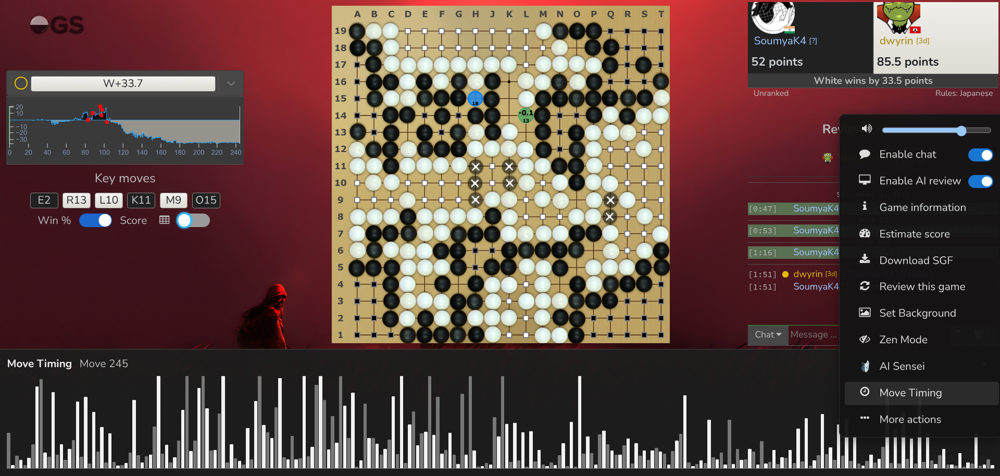
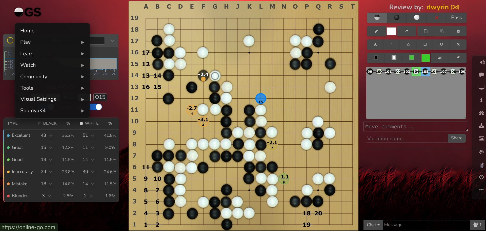

# OGS Custom Cosmetics + UI/UX

A Tampermonkey userscript that restores a compact, board-focused layout on Online-Go.com game, review, and demo pages. Version 4.0.4 keeps OGS responsible for game behavior while reorganizing its controls into a cleaner desktop interface.

## Install

1. Install [Tampermonkey](https://www.tampermonkey.net/) in your browser.
2. Open the [raw userscript](https://raw.githubusercontent.com/SoumyaK4/OGS-Tampermonkey/main/OGS-Cosmetic.user.js).
3. Confirm the installation in Tampermonkey.

The script runs on:

- `https://online-go.com/game/*`
- `https://online-go.com/review/*`
- `https://online-go.com/demo/*`

## Features

### Board-focused layout

- Restores a wide, compact desktop layout after the OGS GobanView redesign.
- Keeps the Go board horizontally centered between the left analysis area and right game sidebar.
- Uses transparent empty areas so the selected background remains visible.
- Places the compact result or turn banner directly below the player cards.
- Hides the native top navigation, bottom move controls, and redundant sidebar Rematch button.
- Leaves clearance for the collapsed right Dock so analysis tools, the game tree, move comments, and variation controls remain usable.
- Gives the main analysis toolbar rows a consistent width and alignment.
- Reduces move comments to a one-line default while retaining horizontal and vertical resizing.

### OGS logo navigation

- Hover the OGS logo in the upper-left corner to open the replacement navigation menu.
- Includes nested Play, Learn, Watch, Community, Tools, and account menus.
- Mirrors the live OGS navbar when available, preserving account- and permission-dependent actions.
- Includes a Visual Settings entry that opens OGS Themes & Visuals in the left panel.

### Compact right Dock

The Dock stays partially collapsed until hovered and exposes these controls:

- Master sound volume
- Enable chat
- Enable AI review
- Game information
- Estimate score
- Download SGF
- Review this game on `/game/*` pages
- Set Background
- Zen Mode for hiding or restoring analysis UI
- Open the current record in AI Sensei
- Full-width Move Timing chart
- More Actions: Fork game, Call moderator, Link to game/review, and Add to library

Dock actions delegate to OGS wherever possible, so native dialogs and game behavior remain intact.

### Background choices

Set Background offers four persistent choices:

- Repository default: [`wall.png`](./wall.png)
- Original OGS background
- Any image URL
- A local image uploaded from your computer

Background preferences are saved in browser local storage. Very large uploaded images can exceed the browser storage limit; use a smaller image if that happens.

### AI review layout

- Places the native AI win-rate graph, key moves, toggles, and score-type summary in the left column on wide screens.
- Centers the Win % and Score controls.
- Keeps unused parts of the analysis panel transparent.
- Preserves the native AI review controls and data.

### Move Timing

- Uses timing data already loaded by OGS when available.
- Falls back to the matching OGS game or review API record.
- Shows every move in a full-width bar chart at the bottom of the page.
- Highlights the currently displayed move and shows its duration.
- Lets you click a bar to jump directly to that move.

### Mouse-wheel move navigation

Use the mouse wheel over the board:

| Input | Action |
| --- | --- |
| Wheel | Previous or next move |
| Shift + wheel | Back or forward 10 moves |
| Ctrl + wheel | First or last move |

## Screenshots

### Game page with right Dock, and Move Timing

### Review/Analysis/Demo page with left hover menu

## Notes

- The custom Dock is hidden when OGS switches the board to its portrait/mobile layout.
- Move Timing depends on per-move timing information being present in the OGS record.
- OGS is a frequently updated single-page application. If its internal markup changes, a userscript update may be required.

## Credits

- Mouse-wheel navigation was inspired by [kvwu](https://kvwu.io/).
- Zen Mode was inspired by this [OGS forum discussion](https://forums.online-go.com/t/feature-request-to-put-review-tools-in-a-collapsible-panel/56968/6?u=soumyak4).
- The userscript’s Move Timing display replaces the older embedded timing interface; the original integration referenced [ogs-move-timing](https://psalaets.github.io/ogs-move-timing/).

## License

Do whatever you want, IDC. I've tried to include simple comments in the code itself

## My Other Projects

[https://soumyak4.in](https://soumyak4.in)